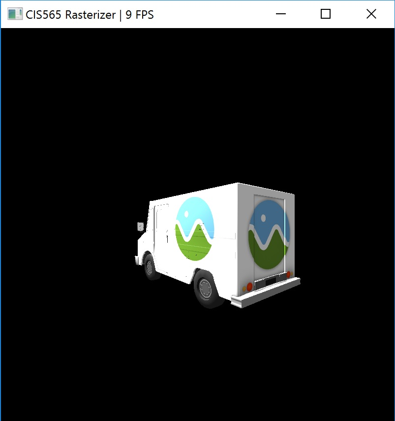

CUDA Rasterizer
===============

**University of Pennsylvania, CIS 565: GPU Programming and Architecture, Project 4**

* Hanming Zhang
* Tested on: Windows 10 Education, i7-6700K @ 4.00GHz 16.0GB, GTX 980 4096MB (Personal Desktop)

Project Features
================

### Representative gifs :
 |  
------------ | -------------
white cow + bloom(post processing) | white cow
 |  
wireframe cow + bloom(post processing) | wireframe cow

### CUDA Rasterizer Features :
 -  Basic rasterizer pipeline stages : vertex shading, primitive assembly, rasterization, Lambert fragment shading, depth buffer
 -  Self Rotating table(rotation speed is fixed & Shared memory used)
 -  Bloom post processing (Downscale + brightness filter + Gaussian blur(shared memory used))
 -  Back face culling (both naively in rasterizer or an independent pipeline stage(remove primitives using thrust::remove_if))
 -  Correct color (vertex property) interpolation between vertices on a primitive
 -  Wireframe / Points
 -  SSAA & \*MSAA (very strictly speaking, it's a "stupid" MSAA so far, still have problems, but it works in some "stupid" way, see related analysis below)
 -  bilinear filtering

### Controls :
 - Left mouse button to rotate Camera
 - Right mouse button to move Camera
 - Middle mouse button to zoom in/out
 - 1, 2, 3  to switch to rasterize whole triangle / wireframe / points mode
 - P key to turn on / off bloom post effect

### About Toggleable Macros :
 To enable/disable some features, just uncomment/comment Macros in ***rasterizer.cu***

 - #define **GAUSSIANBLUR_SHAREDMEMORY** : Shared memory use in Gaussian Blur
 - #define **SSAAx2** : SSAA, in our case, (width * 2) * (height * 2)
 - #define **MSAAx2** : it's a "stupid" MSAA so far, still have problems, but it works in some "stupid" way, see related analysis below
 - #define **BACKFACE_CULLING_IN_PIPELINE** : back face culling in pipeline  (remove unwanted primitive using thrust::remove_if)
 - #define **BACKFACE_CULLING_IN_RASTERIZER** : back face culling in a naive way (directly do test in rasterize kernel)
 - #define **CORRECT_COLOR_LERP** :  Correct color interpolation between points on a primitive
 - #define **BILINEAR_TEXTURE_FILTER** : texture bilinear filtering

### Project Analysis (Under x64 Release mode)
- #### Basic rasterizer pipeline analysis
  ##### In this analysis, no special effects are used, bloom post processing, correct color lerp, back face culling and AA are turned off. Tests are for rasterize whole triangle mode. Each test run 10 seconds. Data are from Nsight Performance Test. cow, flower and Cesium Milk truck glTFs are used here.

  

  ##### Analysis:
  First of all, broadly speaking, rasterizer_fill kernel takes up most of time. It's understandable since what rasterizer_fill does is rasterizing each primitive, checking each pixel of that primitive's bounding box to see if it's inside the triangle, doing atomic depth buffer writing and depth test, and finally writing the fragment buffer if it pass tests.
  Cow.gltf has the highest average FPS among three, it's mainly because it's relatively simple primitives(triangles) layout, and in most cases, there won't be so many fragments overlapping on the same pixel(maybe 3, 4 at maximum). As a result, it's naturally more efficient than the other two when rasterizing, and there are more frames generated(thus render kernel is called more frequently and higher FPS).
  Flower.gltf is known for its fragment overlapping. it's complex primitives(triangles) layout determines that there will be so many fragments generated in the same pixel. Most of them are redundant and actually only one fragment will be used in fragment shading stage. Also, because of this, more time will be wasted on atomic depth buffer writing, which causes more waiting and waste time. As a result, less frames generated and lower average FPS.
  CesiumMilkTruck.gltf actually "only" has 3624 primitives(triangles), which is not a so big number compared to cow and flower. But it is composed of 5 mesh components(window, glass, truck...), which means vertex shading and primitive assembly kernels will be repeatedly called 5 times in one frame, so is rasterizer_fill kernel. Besides that, since it's a heavily textured mesh, it takes a lot of extra time to fetch texture color from global memory. So, less frames generated and lower FPS.

- #### Rasterizer pipeline with bloom post processing stages analysis
  ##### In this analysis, bloom post processing is turned on based on basic pipeline. Gaussian blur with and without using shared memory is compared. Each test run 10 seconds. Cow.gltf is used. Data are from Nsight Performance Test. Bloom stage post processing pipeline is shown as below :

  

  About bloom post effect: the basic idea about bloom effect is actually simple. First what brightness filter does here is summing up every component of color value(r, g, b) of frame buffer, setting a threshold and only keep values that passes it. Then downscale our frame by 10. The reason of doing this is that we don't want to waste time sampling a so large area of pixels("kernel size" in Gaussian blur) during Gaussian blur. If we sample a downscaled image, it has the same effect as Gaussian blur a large area of pixels.
  Also, to make Gaussian blur more efficient, instead of sampling the whole area, we first sample horizontally and then vertically. This means that, for example, in our case, we sample an area of 11x11 pixels, and if we sample horizontally and then vertically, 11 + 11 = 22 samples are needed, and if we sample an area, 11x11 = 121 samples are needed. Finally, we just combine the blur result with the original frame buffer.

  Main reference : [OpenGL Bloom Tutorial by Philip Rideout](http://prideout.net/archive/bloom/index.php)  

  Here are two pure Gaussian blur image :

 | 
-------------------------- | ----------------------------
GassianBlur white cow | GassianBlur wireframe cow + downscale by 5

  

  ##### Analysis:
  Basically, 5 extra stages in bloom post processing pipeline, but fortunately, not so many extra time is used. The reason is pretty simple, except for brightness filter and combining frame buffer, downscale sample, horizontal and vertical Gaussian blur all happens on a (width/10) x (height/10) frame buffer (although I add 20 fringe pixels horizontally and vertically in order to more easily read shared memory). Besides that, the input is only a frame buffer, and we can forget about all complex fragment buffer stuff here and in our case, the input color for frame buffer is fixed, so no so much extra time is cost and FPS is not influenced so much.
  In terms of shared memory I used here. It's super straight-forward, and far more less global memory read needed if we use shared memory(we first store a tile into share memory, and tile size is decided by block size). So we can see 100% improvement in case of horizontal and vertical Gaussian blur.

- #### Back face culling analysis
  ##### In this analysis, I use basic rasterizer pipeline. No special effects is turned on. Cow.gltf is used. Each test run 10 seconds.
  In terms of back face culling, I basically try 2 ways :
  1. add an if statement in rasterize stage
  2. Before rasterize stage, copy device primitive array to an new array, and use thrust::remove_if to remove back facing primitives

  

  ##### Analysis:
  The result show that in case of cow.gltf, back face culling doesn't have apparent influence. For the first back face culling way, if we directly add an if statement in our rasterize stage, there will be a lot of divergence happening. For the second method, we need extra time to do CUDA device memory to device memory copy and thrust::remove_if. So as we can see above, the time rasterizer_fill used is less than the other two.  

- #### Correct color interpolation between vertices on a primitive
  ##### I assign red, green and blue color to each vertex of our triangles, and interpolate color for each fragment. We can get a colorful cow like below. BTW, I turn on bloom effect here, which I think is cool.
  Acutally not only color, any property should use perspective correct interpolation, including normal or position. Like this duck, looks pretty smooth(correct normal interpolation) using Lambert shading

 |  | 
-------------------------- | ---------------------------- | ----------------------------
cow + color lerp + bloom | duck | cesium milk truck

- #### wireframe and points

 | 
-------------------------- | ----------------------------
wireframe cow | point cow

- #### AA analysis
  ##### In this analysis, I use basic rasterizer pipeline. No special effects is turned on. Cow.gltf is used.
  1. SSAAx2 : this method is pretty straight-forward, every stage in our pipeline will handle a (2 \* width) * (2 \* height) size frame buffer. Then finally, before it is sent to PBO and let OpenGL render it, we sample 4 pixels and average its color value to get one pixel color value we want.
  2. \*MSAAx2 : The main reason why I call MSAA I implement "stupid" here is that the fragment buffer size in our project is fixed. There is only width \* height size fragment buffer. However, ideally, fragment buffer size should be dynamic, so that we can have more fragments on geometry edges, and then in fragment shading stage, we shade all of them, and maybe get an average color where there are several fragments in one pixel. As a result, considering there is no time for me to reconstruct everything to get a dynamic size fragment buffer, I have to select between width \* height size or (2 \* width) \* (2 \* height) to realize MSAA. So the basic algorithm I use here is :

    

    - instead of sampling every red dot we sample in SSAA, we try to sample blue dots. (since we use a (2 \* width) \* (2 \* height) size fragment buffer, it actually lay out like red dots). As a result, our stride should be 2 (add 2 for each iteration) and each iteration should start with adding 0.5(blue dot position)
    - When the blue dot is close to geometry edge(like the pink line I draw in picture), we sample all four red dots in that quad. When blue dot is in the geometry(triangle), we sample blue dot once and use that sampled fragment value to fill all four red subsamples fragment buffers.

   as a result, a lot of time is used detect whether our sampled point is near the edge and fill all sub sample fragment buffers. These extra actions will definitely slow down the MSAA process, which make it slower than SSAA and that's the reason why I call it "stupid". Although some noise points appearing using this algorithm, but it works anyway. :)

   Here are some detail images:

 |  | 
-------------------------- | ---------------------------- | ----------------------------
no AA | SSAAx2 | MSAAx2

- #### bilinear texture filtering
  ##### When fetching from texture, the texture is very likely not displayed exactly as it is stored. Because of this, most pixels will end up needing to use a point on the texture "between" texels. Bilinear filtering uses points to perform bilinear interpolation between the four texels to the point that the pixel represents. Refers to [Bilinear filtering](https://en.wikipedia.org/wiki/Bilinear_filtering)

 | 
-------------------------- | ----------------------------
no bilinear filtering | bilinear filtering

### Credits

* [tinygltfloader](https://github.com/syoyo/tinygltfloader) by [@soyoyo](https://github.com/syoyo)
* [glTF Sample Models](https://github.com/KhronosGroup/glTF/blob/master/sampleModels/README.md)
